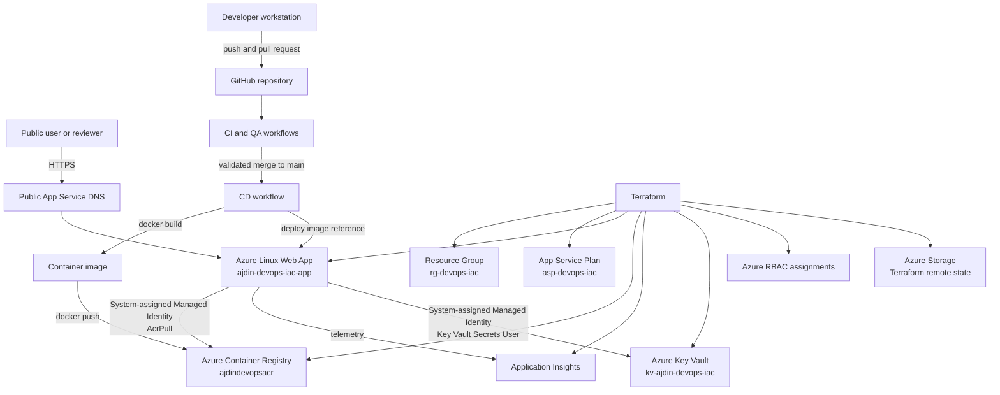
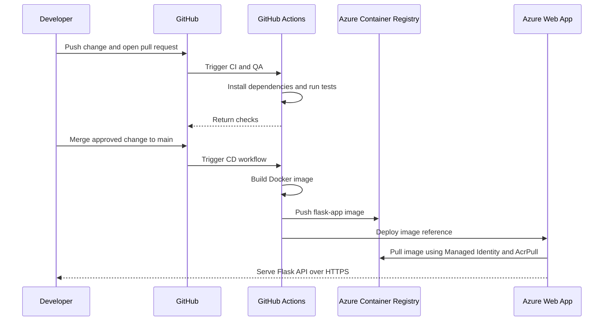
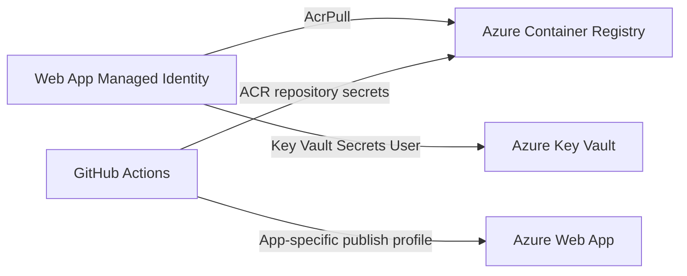
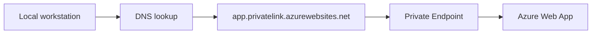
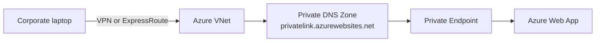

# Architecture

## 1. Final working architecture



## 2. Delivery sequence



## 3. Infrastructure ownership

Terraform manages the target cloud architecture:

```text
Terraform configuration
├── Resource Group
├── App Service Plan
├── Linux Web App
│   └── System-assigned Managed Identity
├── Azure Container Registry
├── Application Insights
├── Key Vault
├── RBAC assignments
└── Remote state backend
```

GitHub Actions manages application delivery:

```text
GitHub Actions
├── CI validation
├── QA validation
├── Docker build
├── ACR push
└── Web App deployment
```

## 4. Identity and access flow



### Important distinction

- The Managed Identity belongs to the Web App and is used by Azure resources at runtime.
- The GitHub workflow identity or publish profile is used by the deployment pipeline.
- A publish profile is tied to a specific Web App. A profile for one app cannot be used with another `app-name`.

## 5. Private Endpoint experiment

### Observed design



The Private Endpoint connection was approved, and the application hostname resolved through `privatelink.azurewebsites.net`. The local machine did not have a complete route and DNS setup for private access, so the application was unreachable from that machine.

### Correct private-only design



Required components for a complete private design:

1. VNet and dedicated Private Endpoint subnet.
2. Private Endpoint connected to the Web App `sites` subresource.
3. Private DNS Zone named `privatelink.azurewebsites.net`.
4. VNet link for the Private DNS Zone.
5. An A record in the private zone for the Web App private IP.
6. Client access through a VM inside the VNet, VPN, ExpressRoute, or correctly integrated corporate network.
7. Optional disabling of public network access after private connectivity is verified.

### Current demo decision

The Private Endpoint was removed so the interview/demo environment remains publicly reachable. The experiment still demonstrated:

- creation and approval of a Private Endpoint
- the DNS CNAME change to `privatelink.azurewebsites.net`
- the difference between public and private access paths
- why private DNS and VNet connectivity are required

## 6. Main troubleshooting timeline

```text
CD workflow targeted the old Web App
    ↓
Publish profile did not match the new app-name
    ↓
Final CD target changed to ajdin-devops-iac-app
    ↓
Web App Managed Identity lacked AcrPull
    ↓
AcrPull assigned and Managed Identity ACR pull enabled
    ↓
Private Endpoint redirected DNS to Private Link
    ↓
Local machine had no private network access path
    ↓
Private Endpoint removed for the public demo
    ↓
Public DNS restored and Web App became reachable
    ↓
Merge to main and deployment succeeded
```

## 7. Recommended production evolution

```text
Current public demo
    ↓
OIDC-based GitHub authentication
    ↓
Immutable image tags
    ↓
Multiple environments and deployment slots
    ↓
Private Endpoint plus Private DNS and VPN access
    ↓
Public access disabled
    ↓
Alerts, dashboards, and operational runbooks
```
