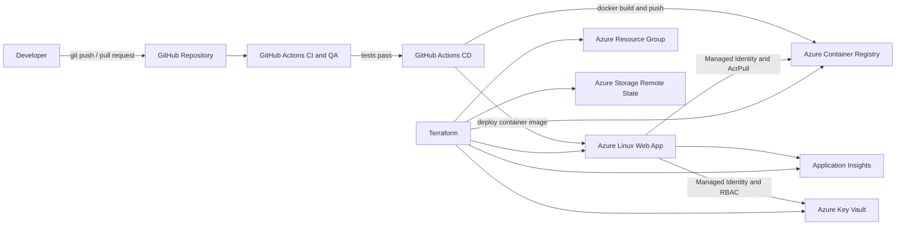

# Azure DevOps Flask Assignment

A hands-on DevOps project that containerizes a Python Flask API, validates it through GitHub Actions, stores the image in Azure Container Registry, and deploys it to an Azure Linux Web App. Azure infrastructure is managed with Terraform and includes remote state, Application Insights, Managed Identity, Key Vault, and RBAC.

## Live application

- Web App: `ajdin-devops-iac-app`
- Default hostname: `ajdin-devops-iac-app.azurewebsites.net`
- Environment: `dev`
- Azure region: `swedencentral`

## What this project demonstrates

- Source control with Git and GitHub
- Feature branch and pull request workflow
- Branch protection and merge checks
- CI, QA validation, and CD with GitHub Actions
- Docker image build and versioning
- Image storage in Azure Container Registry
- Container deployment to Azure App Service
- Infrastructure as Code with Terraform
- Terraform remote state in Azure Storage
- Import and management of existing Azure resources
- Monitoring with Application Insights
- Passwordless Azure resource access with Managed Identity
- RBAC assignments for Key Vault and ACR
- Azure networking and Private Endpoint troubleshooting

## Architecture



> Current demo state: the Web App uses its public App Service endpoint. A Private Endpoint was implemented and validated during the assignment, then removed because the demo machine did not have the complete private DNS and VNet access path required for private-only connectivity.

## Technology stack

| Area | Technology |
|---|---|
| Application | Python, Flask |
| Testing | pytest |
| Source control | Git, GitHub |
| CI/CD | GitHub Actions |
| Containers | Docker |
| Cloud | Microsoft Azure |
| Infrastructure as Code | Terraform |
| Container registry | Azure Container Registry |
| Runtime | Azure Linux Web App / App Service |
| Monitoring | Application Insights |
| Secrets and identity | Azure Key Vault, Managed Identity, Azure RBAC |
| State management | Terraform remote state in Azure Storage |

## Repository structure

```text
DevOpsAssignment/
├── .github/
│   └── workflows/
│       ├── ci.yml
│       ├── qa.yml
│       ├── cd.yml
│       └── cd_dev.yml
├── terraform/
│   ├── main.tf
│   ├── variables.tf
│   ├── outputs.tf
│   ├── acr.tf
│   ├── keyvault.tf
│   └── backend.tf
├── tests/
├── app.py
├── requirements.txt
├── Dockerfile
├── .dockerignore
├── .gitignore
├── README.md
├── ARCHITECTURE.md
└── INTERVIEW_PREPARATION.md
```

> The exact Terraform filenames can differ. Terraform loads all `.tf` files in the working directory as one configuration.

## Azure resources

| Resource | Name |
|---|---|
| Resource Group | `rg-devops-iac` |
| Service Plan | `asp-devops-iac` |
| Linux Web App | `ajdin-devops-iac-app` |
| Container Registry | `ajdindevopsacr` |
| Key Vault | `kv-ajdin-devops-iac` |
| Environment | `dev` |
| Owner tag | `Ajdin` |

## Application response

The Flask API returns a simple JSON payload similar to:

```json
{
  "message": "Zdravo Ajdine",
  "project": "DevOps Assignment"
}
```

## Run locally

### 1. Create and activate a virtual environment

```powershell
py -m venv .venv
.\.venv\Scripts\Activate.ps1
```

### 2. Install dependencies

```powershell
py -m pip install -r requirements.txt
```

### 3. Run tests

```powershell
py -m pytest
```

### 4. Start the Flask application

```powershell
py app.py
```

## Run with Docker

```powershell
docker build -t flask-app:v1 .
docker run --rm -p 5000:5000 flask-app:v1
```

Test locally:

```powershell
curl http://localhost:5000
```

## Terraform workflow

Run Terraform commands from the `terraform` directory:

```powershell
cd terraform
terraform fmt
terraform init
terraform validate
terraform plan
terraform apply
```

Inspect managed resources:

```powershell
terraform state list
terraform output
```

Destroy only when cleanup is intentional:

```powershell
terraform destroy
```

## CI/CD flow

```text
Developer change
    ↓
Push to branch
    ↓
CI and QA validation
    ↓
Pull request and protected merge
    ↓
Merge to main
    ↓
Docker image build
    ↓
Push image to ACR
    ↓
Deploy image to ajdin-devops-iac-app
    ↓
Public Flask endpoint available
```

The CD workflow must use the same App Service name as Terraform:

```yaml
app-name: ajdin-devops-iac-app
```

The `AZURE_WEBAPP_PUBLISH_PROFILE` GitHub secret must contain the complete publish profile downloaded for that exact App Service. The ACR credentials are stored as GitHub secrets and are not committed to the repository.

## Security design

### Managed Identity

The Linux Web App uses a system-assigned Managed Identity. This avoids embedding Azure service credentials in application code.

### ACR access

The Web App identity has the `AcrPull` role scoped to `ajdindevopsacr`, and App Service is configured to use Managed Identity when pulling the container image.

### Key Vault access

The Web App identity has the `Key Vault Secrets User` role on `kv-ajdin-devops-iac`.

### Secret-management note

A demonstration secret was intentionally removed from Terraform after Azure returned a Key Vault data-plane authorization error for the identity running Terraform. The Key Vault and RBAC architecture remain implemented, while secret creation should be completed only after confirming the deployment identity has the required data-plane permissions.

## Monitoring

Application Insights is provisioned for application monitoring and diagnostics. The project can be extended with:

- availability tests
- alert rules
- action groups
- structured application telemetry
- dashboards and log queries

## Troubleshooting lessons

### 1. Deployment target mismatch

**Symptom:** GitHub Actions succeeded, but the Terraform-managed Web App did not show the application.

**Root cause:** `cd.yml` targeted `ajdin-flask-devops-2026`, while Terraform managed `ajdin-devops-iac-app`.

**Resolution:** Align the workflow `app-name` and publish profile with `ajdin-devops-iac-app`.

### 2. Invalid publish profile

**Symptom:** `Publish profile is invalid for app-name and slot-name provided`.

**Root cause:** The publish profile belonged to a different App Service than the `app-name` specified in the workflow.

**Resolution:** Download the publish profile for `ajdin-devops-iac-app`, replace the GitHub secret, and rerun the workflow.

### 3. ACR pull authorization

**Symptom:** The Web App container configuration showed an ACR image but the Managed Identity had no ACR role.

**Root cause:** The Web App identity had Key Vault access but did not have `AcrPull` on the registry.

**Resolution:** Assign `AcrPull` at the ACR scope and enable `acrUseManagedIdentityCreds` for the Web App.

### 4. Private Endpoint and DNS

**Symptom:** The hostname resolved to `privatelink.azurewebsites.net`, and the application could not be reached from the local machine.

**Root cause:** A Private Endpoint existed without a complete access path through a VNet, private DNS zone, and VPN or another client inside the VNet.

**Resolution for this demo:** Remove the Private Endpoint and keep public network access enabled. DNS then returned the public App Service endpoint and the application became reachable.


## Current status

- Flask API: working
- Docker image: working
- ACR push: working
- Terraform-managed Web App: working
- Public App Service DNS: working
- CI and merge checks: working
- CD to the final Web App: working
- Terraform remote state: configured
- Application Insights: provisioned
- Managed Identity: enabled
- `AcrPull`: assigned
- Key Vault: provisioned
- Key Vault RBAC: assigned
- Private Endpoint: validated and removed from the public demo design

## Possible next improvements

- Replace publish-profile authentication with GitHub OpenID Connect
- Use immutable image tags such as `${{ github.sha }}` instead of a fixed `v1`
- Add Terraform-managed `AcrPull` assignment and Managed Identity ACR configuration
- Complete Key Vault secret consumption from the Flask application
- Implement dev, test, and prod environments
- Add deployment slots and approval gates
- Add availability alerts and operational dashboards
- Reintroduce Private Endpoint with Private DNS Zone, VNet linkage, and VPN or VNet-based access
- Add a custom domain and managed TLS certificate
- Add automated Terraform plan checks to pull requests

## Author

Ajdin Aladžuz
